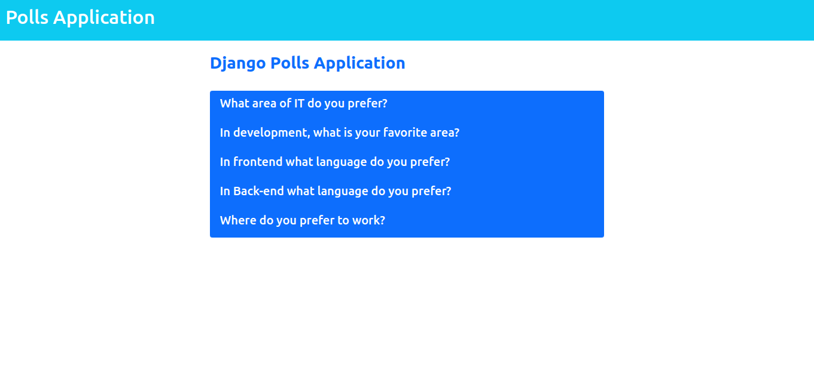
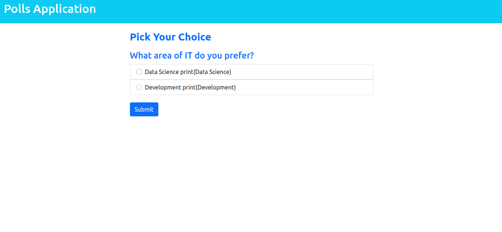
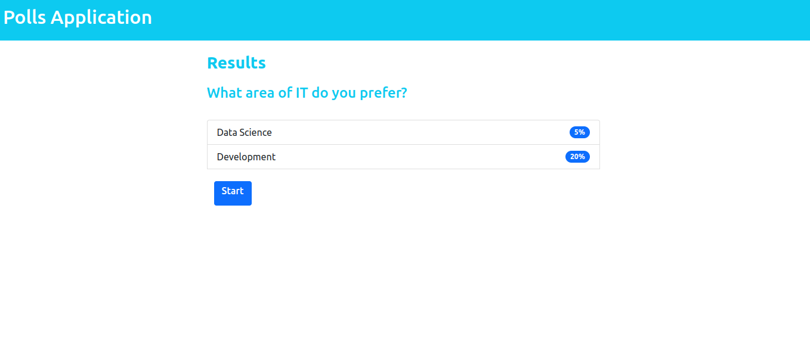

##  👨‍🎓  systempolls  👨‍🎓 
___
___

<details>

<summary>  🔎 Sistema de encuestas 🔎 </summary>

Construir un sistema de encuesta en el cual se pueda escoger una pregunta y se pueda votar por las opciones que tiene disponible para finalmente ver la cantidad de votos que tiene cada opción de la pregunta seleccionada.

**recursos:**

https://arizamoises.notion.site/Material-apoyo-Framework-Django-a3114df81e7d4f21a620fe735fc0e623

Contexto del proyecto
Contexto del proyecto

Subimos el nivel ahora ya vas a tomar de la documentación oficial de Python para construir un sistema de encuestas para hacer votaciones al tema que prefieras solo ten en cuenta los siguientes requerimientos:

- Debe hacer uso de archivos estáticos para su personalización de interfaz (CSS, imágenes o javascript de ser - - necesario)

- El nombre del proyecto será **systempolls** y el de la aplicación será **polls**
Debe contar con al menos **5 preguntas** las cuales vana tener **tres opciones para escoger**

- Como debe realizarse en el menor tiempo posible, también se recomienda el uso de  Boostrap 5 para la personalización de los templates

- De hacer uso de una base de datos en MYSQL para el almacenamiento de las preguntas y selecciones
- Todos los templates deben heredar de una **estructura base (un archivo base.html)**
- Debe trabajar sobre un entorno virtual
- Debe proteger las variables de entorno que va a usar para el acceso a las bases de datos a través del archivo .env
- Debe contar con un archivo gitignore
- Debe tener un archivo requirements.txt
- Debe contar con un despliegue en Heroku
- Debe compartir el usuario y contraseña de superadministrador en el despliegue

### Modalidades pedagógicas
Realización de trabajo autónomo para imitar y transponer según las preferencias del estudiante

Resolución de problemas con base en la información proporcionada

### Criterios de rendimiento
Código en repositorio siguiendo buenas prácticas de desarrollo
Despliegue funcional
Personalización del sistema creado con base en su criterio como desarrollador

### Modalidades de evaluación
Revisión de desarrollo y funcionamiento del sistema creado por parte del formador con su respectiva retroalimentación.

### Entregables
- Link de github con su respectivo Readme bien organizado 
- Debe tener buenas prácticas de trabajo el código como gitignore, manejo de seguridad básica para variables de entorno (env) y entorno virtual
- Despliegue en Heroku
- Las credenciales para revisar en el despliegue el administrador de Django
- El plazo máximo será hasta el martes 3 de mayo

____

</details>

```python

- crear entorno virtual **virtualenv**:
  ** pip install virtualenv==20.14.1 **
- crear variables de entorno para la base de datos y django:
   ** pip install python-decouple==3.6 **
- crear directorio o carpeta en windows o linux por fuera del proyecto y la aplicación Django.

crear .env: 

NAME = 'yourName_Bd'
USER = 'yourUserNameOn_Bd'
PASSWORD = '*yourPassword_Bd'
HOST = 'yourHostOrIp_Bd'
PORT = 'YourPortUser_Bd'
##
SECRET_KEY = 'SecretKey_Django setting.py'

```
___

```python
pip freeze > requirements.txt

asgiref==3.5.0
autopep8==1.6.0
dj-database-url==0.5.0
Django==4.0.4
gunicorn==20.1.0
mysqlclient==2.1.0
pycodestyle==2.8.0
python-decouple==3.6
python-dotenv==0.20.0
#sqlparse==0.4.2
toml==0.10.2
tzdata==2022.1
whitenoise==6.0.0

install:
pip install -r requirements.txt

```
___

```python
django-admin startproject systempolls
python3 manage.py startapp polls

migrations:
python3 manage.py makemigrations
python3 manage.py migrate 

```
___

[]()

___

[]()

___

[]()

___

**github** 👨‍💻 :octocat:
___

- 👨‍💻 **[Dario Higuera Moreno]( https://github.com/dariohimo)**

___
---

## deploy 
**Heroku** 📜
- **[HEROKU]( https://qqpolls.herokuapp.com/)**
---

**GITHUB** :octocat:
- **[GITHUB]( https://github.com/dariohimo/systempolls)**

___
---
